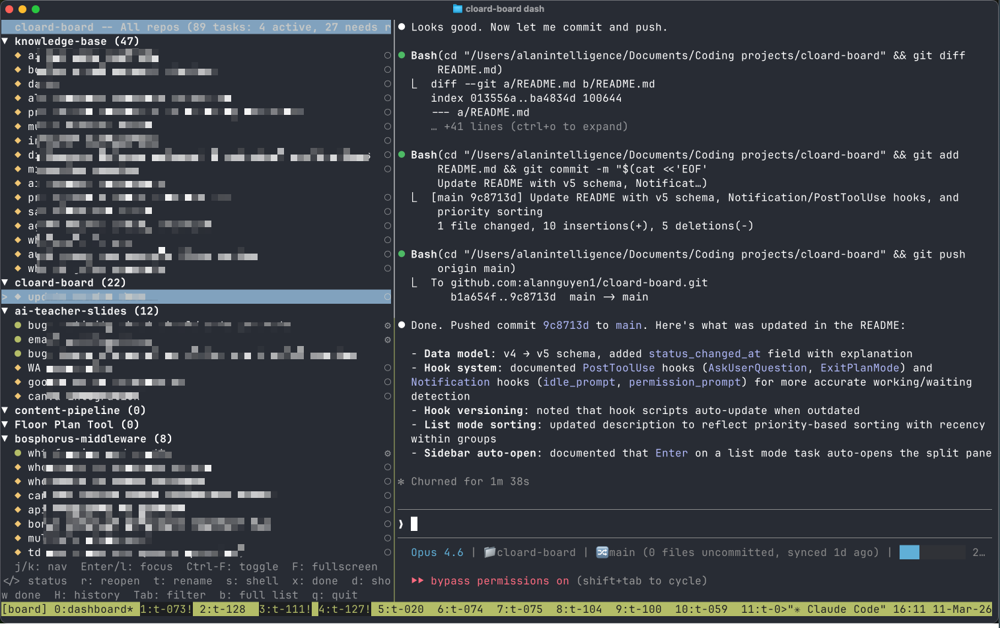

# cloard-board

A multi-repo tmux kanban dashboard for managing parallel [Claude Code](https://docs.anthropic.com/en/docs/claude-code) worktree sessions.

Run multiple Claude agents across different repositories in isolated git worktrees, track their progress on an interactive terminal board, and advance tasks through a kanban workflow: pending, active, needs review, done.


## Install

**Option A: Clone and install**

```sh
git clone https://github.com/alannguyen1/cloard-board.git
cd cloard-board
./install.sh
```

**Option B: Manual**

```sh
curl -fsSL https://raw.githubusercontent.com/alannguyen1/cloard-board/main/cloard-board -o ~/.local/bin/cloard-board
chmod +x ~/.local/bin/cloard-board
```

Make sure `~/.local/bin` is in your `PATH`.

## Quick start

```sh
# Register your repos
cloard-board repo add ~/code/my-api
cloard-board repo add ~/code/frontend
cloard-board repo add ~/scripts          # non-git directories work too

# Add tasks (IDs are auto-generated)
cloard-board add --title "Fix auth bug" --repo my-api
cloard-board add --title "Update styles" --repo frontend

# Start working
cloard-board start t-001 "Fix the auth redirect loop in middleware"

# Open the multi-repo dashboard
cloard-board dash
```

### Migrating from v0.1 (single-repo)

If you have an existing `.cloard-board/` directory from v0.1, run any command from that repo's root. cloard-board will offer to migrate your tasks to the global state automatically.

## Commands

### Repo management

| Command | Description |
|---|---|
| `repo add <path>` | Register a directory (git or non-git) |
| `repo remove <name>` | Unregister a repo (tasks become orphaned) |
| `repo list [--all]` | List registered repos with status |
| `repo update-path <name> <path>` | Update a repo's directory path |
| `repo archive <name>` | Hide a repo from the dashboard |
| `repo unarchive <name>` | Restore an archived repo |

### Task commands

| Command | Description |
|---|---|
| `add [--title "..."] [--repo name]` | Add a task with auto-generated ID. Use `--no-worktree` to skip branch isolation |
| `session <uid> [--repo] [--title]` | Import an existing Claude session by UID |
| `title <id> <new-title>` | Rename a task |
| `start <id> [prompt]` | Launch Claude in a new worktree; task becomes active |
| `pause <id>` | Pause a task: kill tmux window but keep worktree |
| `go <id>` | Switch to a task's tmux window |
| `resume <id>` | Reopen a task with `claude --continue` |
| `reopen <id> [prompt]` | Reopen a done task (restarts the session) |
| `advance <id>` | Move task to the next status in the pipeline |
| `done <id>` | Clean up worktree, branch, and tmux window |
| `rm <id>` | Remove a task entirely (cleans up resources) |
| `list [--repo name]` | Print all tasks (optionally filtered by repo) |
| `status <id>` | Show task details and Claude status |
| `signal <id> <status>` | Set Claude status: `working`, `waiting`, or `clear` |

### Cron jobs

Schedule and manage recurring Claude Code tasks via macOS LaunchAgents.

| Command | Description |
|---|---|
| `cron scan` | Discover Claude-invoking LaunchAgents on this machine |
| `cron add` | Create a new cron job (interactive) |
| `cron list` | List all cron jobs |
| `cron runs [job-id]` | List active and unreviewed runs |
| `cron enable <id>` | Enable and load a cron job |
| `cron disable <id>` | Disable and unload a cron job |
| `cron remove <id>` | Delete a cron job (with confirmation) |
| `cron review <run-id>` | Mark a run as reviewed |
| `cron migrate` | Import existing Claude LaunchAgents |

### Dashboard and utilities

| Command | Description |
|---|---|
| `dash` | Open the interactive multi-repo kanban dashboard |
| `attach` | Attach to the cloard-board tmux session |
| `doctor` | Check for orphaned worktrees, windows, and stale repo paths |
| `init` | Register current directory as a repo (shortcut for `repo add .`) |

## Dashboard keybindings

### All-repos view

| Key | Action |
|---|---|
| `j` / `k` (or arrows) | Move between repo rows (cron row at bottom) |
| `h` / `l` (or arrows) | Move between columns |
| `Enter` | Zoom into selected repo (card-level navigation) |
| `Esc` | Zoom back out to repo-level navigation |
| `Tab` | Cycle filter: All > Repo 1 > Repo 2 > ... > All |
| `Shift-Tab` | Cycle filter in reverse |

### Card-level / filtered view

| Key | Action |
|---|---|
| `j` / `k` (or arrows) | Move between cards in a column |
| `h` / `l` (or arrows) | Move between columns |
| `Enter` | Open/start/attach to the selected task |
| `c` | Open new task modal (repo, title, worktree, prompt) |
| `S` | Import an existing Claude session by UID |
| `t` | Rename the focused task |
| `p` | Pause: kill the tmux window but keep the worktree |
| `r` | Reopen a done task (restart session) |
| `x` | Mark task as done (or remove if already done) |
| `d` | Toggle show/hide done tasks |
| `>` / `.` | Move task to the next status |
| `<` / `,` | Move task to the previous status |
| `:` / `"` | Reorder card up/down within a column |
| `s` | Shell popup: view the task's terminal output |
| `H` | Open session history modal (switch between previous sessions) |
| `v` | Switch to list view |
| `R` | Register a new repo |
| `q` | Quit (detach from tmux) |

### List view

Press `v` to switch between kanban and list views. The list view shows all tasks in a flat, scrollable list grouped by repo with priority sorting: active+working, active+waiting, active, needs review, pending, paused, done. Within each priority group, tasks are sorted by most recently changed first.

#### Full list mode

| Key | Action |
|---|---|
| `j` / `k` | Navigate items |
| `Tab` / `Shift-Tab` | Cycle repo filter |
| `Enter` | Open task or toggle group collapse |
| `>` / `<` | Move task to next/previous status |
| `:` / `"` | Reorder task up/down |
| `r` | Reopen a done task |
| `t` | Rename the focused task |
| `s` | Shell popup |
| `x` | Mark task as done (or remove if already done) |
| `d` | Toggle show/hide done tasks |
| `H` | Open session history modal |
| `c` | Open new task modal |
| `b` | Toggle split view (sidebar + Claude session pane) |
| `v` | Switch back to kanban view |
| `Esc` | Collapse current group |
| `q` | Quit |

#### Sidebar mode (split view)

Press `b` in list mode to open a split pane: a narrow task sidebar on the left (40%) and the selected task's Claude session on the right (60%). The split pane also opens automatically when you press `Enter` on a task in list mode.



| Key | Action |
|---|---|
| `j` / `k` | Navigate items in sidebar |
| `Enter` / `l` | Focus the Claude session pane |
| `>` / `<` | Move task to next/previous status |
| `r` | Reopen a done task |
| `t` | Rename the focused task |
| `s` | Shell popup |
| `x` | Mark task as done (or remove if already done) |
| `d` | Toggle show/hide done tasks |
| `H` | Open session history modal |
| `Tab` | Cycle repo filter |
| `b` | Close split, return to full list |
| `Esc` | Close split |
| `q` | Quit |

### Cron row

| Key | Action |
|---|---|
| `Enter` | Col 0: show job details / Col 1: attach to run / Col 2: resume session |
| `x` | Col 0: toggle enable/disable / Col 2: mark run as reviewed |
| `c` | Create a new cron job |
| `D` | Delete cron job (Col 0 only, with confirmation) |

## Task lifecycle

```
pending  -->  active  -->  needs_review  -->  done
   add()      start()        advance()       done()
                 \              |
                  <-- paused <--
                      pause()     resume()
```

Each `start` creates a git worktree (for git repos) and launches `claude --worktree <id>` in a dedicated tmux window. Multiple tasks run truly in parallel, each in their own isolated branch and directory.

### Multi-repo support

Tasks are scoped to repos. When adding a task:
- If `--repo` is specified, the task is assigned to that repo
- If only one repo is registered, it's auto-selected
- If multiple repos exist, you'll see a picker

The dashboard groups tasks by repo. Use `Tab`/`Shift-Tab` to filter to a single repo, or view all repos at once.

### Non-git directories

Register any directory, even without git:

```sh
cloard-board repo add ~/scripts    # type: "dir"
```

Non-git repos always use `--no-worktree` mode. Claude sessions run directly in the registered directory.

### Stale repo handling

If a registered repo's path no longer exists (e.g., you moved the directory), the dashboard shows a warning badge. Tasks in stale repos are visible but not actionable. Fix it with:

```sh
cloard-board repo update-path my-api ~/new/location/my-api
```

### Pausing and reopening tasks

Use `pause` to temporarily free a tmux window without losing work. The worktree and branch remain intact. Resume later with `resume` or press `Enter` on a paused card in the dashboard. Paused tasks appear in the Pending column with cyan coloring.

Use `reopen` to restart a session on a task that's already been marked done. This is useful when you need to revisit completed work.

### Task creation modal

Press `c` in the dashboard to open a centered modal overlay for creating tasks. The modal includes:

- **Repo selector**: dropdown with arrow-key navigation (auto-filled when filtering a single repo)
- **Title**: free-text field
- **Worktree toggle**: on/off radio (locked to "No" for non-git repos)
- **Prompt**: auto-expanding text field (up to 4 lines)

Navigate fields with `Tab`/`Shift-Tab`. Press `Enter` to create and immediately start the task. On terminals narrower than 40 columns, the modal falls back to sequential prompts.

### Session tracking and history

Each task stores a session UID so that `resume` uses `claude --resume <uid>` instead of the less precise `--continue`. Sessions are captured automatically via hooks. If a tmux window dies (e.g., Claude exits), the dashboard detects it and cleans up the window on the next interaction.

Tasks maintain a history stack of up to 10 previous session UIDs. Press `H` in the dashboard (kanban or list mode) to open the session history modal, where you can browse previous sessions and switch to any of them. The selected session becomes the active one for future resume operations.

## Cron jobs

cloard-board can schedule and manage recurring Claude Code sessions via macOS LaunchAgents.

### Discovering existing jobs

```sh
cloard-board cron scan      # find Claude-invoking LaunchAgents
cloard-board cron migrate   # import them into cloard-board
```

### Creating new jobs

```sh
cloard-board cron add       # interactive: set schedule, command, and working directory
```

### Dashboard integration

The cron row appears at the bottom of the dashboard with three columns:

- **Scheduled**: all registered cron jobs (enabled/disabled)
- **Active**: currently running cron sessions
- **Needs Review**: completed runs awaiting review

Runs in "Needs Review" older than 24 hours are auto-archived. The `doctor` command prunes archived runs older than 7 days.

## Claude status indicators

cloard-board tracks whether each Claude session is actively working or waiting for user input:

- **working** (green): Claude is actively processing
- **waiting** (yellow): Claude has stopped and is waiting for a prompt

### How it works

On first run, cloard-board installs global hook scripts in `~/.cloard-board/hooks/` and registers them in `~/.claude/settings.json`. These hooks fire on Claude Code events:

- **UserPromptSubmit**: sets the task to "working" when you send a prompt
- **Stop**: sets the task to "waiting" when Claude finishes a turn
- **PostToolUse** (`AskUserQuestion`, `ExitPlanMode`): sets the task to "waiting" when Claude asks the user a question or exits plan mode
- **Notification** (`idle_prompt`, `permission_prompt`): sets the task to "waiting" when Claude is idle or awaiting permission approval

Hook scripts are versioned and auto-update when cloard-board detects an outdated version.

Each tmux window exports `CLOARD_TASK_ID`, `CLOARD_BOARD_DIR`, and `CLOARD_REPO_PATH` environment variables so hooks know which task to update. The hooks run asynchronously to avoid blocking Claude.

You can also set status manually:

```sh
cloard-board signal t-001 working
cloard-board signal t-001 waiting
cloard-board signal t-001 clear    # remove the indicator
```

Status is automatically cleared when tasks are paused or marked done.

## Data model

All state is stored globally at `~/.cloard-board/state.json`:

```json
{
  "version": 5,
  "next_task_id": 4,
  "next_cron_id": 1,
  "next_run_id": 1,
  "repos": [
    { "name": "my-api", "path": "/Users/you/code/my-api", "type": "git", "base_branch": "main" }
  ],
  "tasks": [
    {
      "id": "t-001", "title": "Fix auth bug", "repo": "my-api", "status": "active",
      "session_uid": "abc-123", "session_history": ["abc-123"],
      "status_changed_at": "2026-03-10T10:00:00Z"
    }
  ],
  "cron_jobs": [],
  "cron_runs": []
}
```

Task IDs are auto-generated (`t-001`, `t-002`, ...) and globally unique across all repos. Cron job IDs follow the same pattern (`cj-001`, `cj-002`, ...) with run IDs as `cr-001`, `cr-002`, etc.

Each task stores a `session_history` array (up to 10 entries, newest first) so you can switch between previous Claude sessions using the `H` key in the dashboard. The `status_changed_at` timestamp tracks when a task last changed status and is used for priority sorting in list mode (newest first within each priority group).

## Dependencies

- **zsh** (the script uses zsh-specific features)
- **tmux** (session and window management)
- **jq** (JSON state file manipulation)
- **git** (worktree management; optional if only using non-git repos)
- **claude** ([Claude Code CLI](https://docs.anthropic.com/en/docs/claude-code))

## Star History

[](https://star-history.com/#alannguyen1/cloard-board&Date)

## License

MIT
