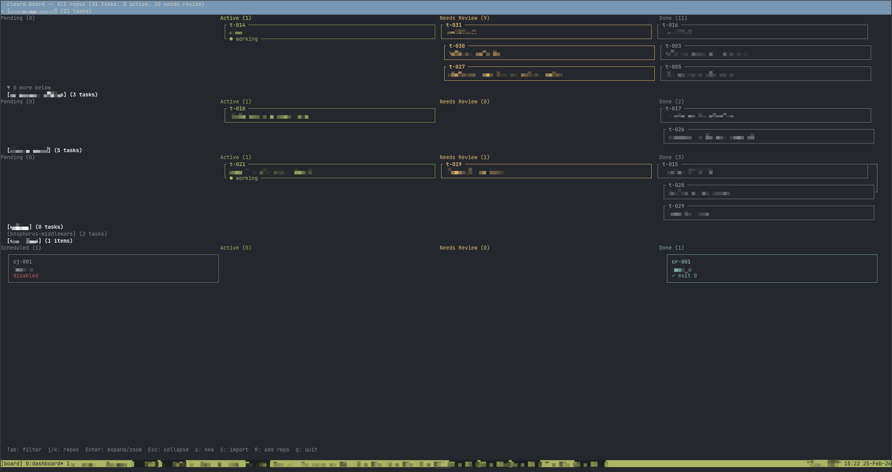

# cloard-board

A multi-repo tmux kanban dashboard for managing parallel [Claude Code](https://docs.anthropic.com/en/docs/claude-code) worktree sessions.

Run multiple Claude agents across different repositories in isolated git worktrees, track their progress on an interactive terminal board, and advance tasks through a kanban workflow: pending, active, needs review, in PR, done.



## Install

**Option A: Clone and install**

```sh
git clone https://github.com/yourusername/cloard-board.git
cd cloard-board
./install.sh
```

**Option B: Manual**

```sh
curl -fsSL https://raw.githubusercontent.com/yourusername/cloard-board/main/cloard-board -o ~/.local/bin/cloard-board
chmod +x ~/.local/bin/cloard-board
```

Make sure `~/.local/bin` is in your `PATH`.

## Quick start

```sh
# Register your repos
cloard-board repo add ~/code/my-api
cloard-board repo add ~/code/frontend
cloard-board repo add ~/scripts          # non-git directories work too

# Add tasks (IDs are auto-generated)
cloard-board add --title "Fix auth bug" --repo my-api
cloard-board add --title "Update styles" --repo frontend

# Start working
cloard-board start t-001 "Fix the auth redirect loop in middleware"

# Open the multi-repo dashboard
cloard-board dash
```

### Migrating from v0.1 (single-repo)

If you have an existing `.cloard-board/` directory from v0.1, run any command from that repo's root. cloard-board will offer to migrate your tasks to the global state automatically.

## Commands

### Repo management

| Command | Description |
|---|---|
| `repo add <path>` | Register a directory (git or non-git) |
| `repo remove <name>` | Unregister a repo (tasks become orphaned) |
| `repo list [--all]` | List registered repos with status |
| `repo update-path <name> <path>` | Update a repo's directory path |
| `repo archive <name>` | Hide a repo from the dashboard |
| `repo unarchive <name>` | Restore an archived repo |

### Task commands

| Command | Description |
|---|---|
| `add --title "..." [--repo name]` | Add a task with auto-generated ID. Use `--no-worktree` to skip branch isolation |
| `start <id> [prompt]` | Launch Claude in a new worktree; task becomes active |
| `pause <id>` | Pause a task: kill tmux window but keep worktree |
| `go <id>` | Switch to a task's tmux window |
| `resume <id>` | Reopen a task with `claude --continue` |
| `advance <id>` | Move task to the next status in the pipeline |
| `review <id>` | Push branch, create a GitHub PR; task becomes "in review" |
| `done <id>` | Clean up worktree, branch, and tmux window |
| `rm <id>` | Remove a task entirely (cleans up resources) |
| `list [--repo name]` | Print all tasks (optionally filtered by repo) |
| `status <id>` | Show task details and Claude status |
| `signal <id> <status>` | Set Claude status: `working`, `waiting`, or `clear` |

### Dashboard and utilities

| Command | Description |
|---|---|
| `dash` | Open the interactive multi-repo kanban dashboard |
| `attach` | Attach to the cloard-board tmux session |
| `doctor` | Check for orphaned worktrees, windows, and stale repo paths |
| `init` | Register current directory as a repo (shortcut for `repo add .`) |

## Dashboard keybindings

### All-repos view

| Key | Action |
|---|---|
| `j` / `k` (or arrows) | Move between repo rows |
| `h` / `l` (or arrows) | Move between columns |
| `Enter` | Zoom into selected repo (card-level navigation) |
| `Esc` | Zoom back out to repo-level navigation |
| `Tab` | Cycle filter: All > Repo 1 > Repo 2 > ... > All |
| `Shift-Tab` | Cycle filter in reverse |

### Card-level / filtered view

| Key | Action |
|---|---|
| `j` / `k` (or arrows) | Move between cards in a column |
| `h` / `l` (or arrows) | Move between columns |
| `Enter` | Open/start/attach to the selected task |
| `o` | Create a new task interactively |
| `p` | Pause: kill the tmux window but keep the worktree |
| `x` | Mark task as done (or remove if already done) |
| `>` / `.` | Move task to the next status |
| `<` / `,` | Move task to the previous status |
| `d` | Show git diff for the selected task's worktree |
| `s` | Shell popup: view the task's terminal output |
| `q` | Quit (detach from tmux) |

## Task lifecycle

```
pending  -->  active  -->  needs_review  -->  review (PR)  -->  done
   add()      start()        advance()        review()        done()
                 \              |
                  <-- paused <--
                      pause()     resume()
```

Each `start` creates a git worktree (for git repos) and launches `claude --worktree <id>` in a dedicated tmux window. Multiple tasks run truly in parallel, each in their own isolated branch and directory.

### Multi-repo support

Tasks are scoped to repos. When adding a task:
- If `--repo` is specified, the task is assigned to that repo
- If only one repo is registered, it's auto-selected
- If multiple repos exist, you'll see a picker

The dashboard groups tasks by repo. Use `Tab`/`Shift-Tab` to filter to a single repo, or view all repos at once.

### Non-git directories

Register any directory, even without git:

```sh
cloard-board repo add ~/scripts    # type: "dir"
```

Non-git repos always use `--no-worktree` mode. The `review` command is disabled for non-git repos since there's no branch to push.

### Stale repo handling

If a registered repo's path no longer exists (e.g., you moved the directory), the dashboard shows a warning badge. Tasks in stale repos are visible but not actionable. Fix it with:

```sh
cloard-board repo update-path my-api ~/new/location/my-api
```

### Pausing tasks

Use `pause` to temporarily free a tmux window without losing work. The worktree and branch remain intact. Resume later with `resume` or press `Enter` on a paused card in the dashboard. Paused tasks appear in the Pending column with cyan coloring.

## Claude status indicators

cloard-board tracks whether each Claude session is actively working or waiting for user input:

- **● working** (green): Claude is actively processing
- **○ waiting** (yellow): Claude has stopped and is waiting for a prompt

### How it works

On first run, cloard-board installs global hook scripts in `~/.cloard-board/hooks/` and registers them in `~/.claude/settings.json`. These hooks fire on Claude Code events:

- **UserPromptSubmit**: sets the task to "working" when you send a prompt
- **Stop**: sets the task to "waiting" when Claude finishes a turn

Each tmux window exports `CLOARD_TASK_ID`, `CLOARD_BOARD_DIR`, and `CLOARD_REPO_PATH` environment variables so hooks know which task to update. The hooks run asynchronously to avoid blocking Claude.

You can also set status manually:

```sh
cloard-board signal t-001 working
cloard-board signal t-001 waiting
cloard-board signal t-001 clear    # remove the indicator
```

Status is automatically cleared when tasks are paused, marked done, or sent to review.

## Data model

All state is stored globally at `~/.cloard-board/state.json`:

```json
{
  "version": 2,
  "next_task_id": 4,
  "repos": [
    { "name": "my-api", "path": "/Users/you/code/my-api", "type": "git", "base_branch": "main" }
  ],
  "tasks": [
    { "id": "t-001", "title": "Fix auth bug", "repo": "my-api", "status": "active", ... }
  ]
}
```

Task IDs are auto-generated (`t-001`, `t-002`, ...) and globally unique across all repos.

## Dependencies

- **zsh** (the script uses zsh-specific features)
- **tmux** (session and window management)
- **jq** (JSON state file manipulation)
- **git** (worktree management; optional if only using non-git repos)
- **claude** ([Claude Code CLI](https://docs.anthropic.com/en/docs/claude-code))
- **gh** (GitHub CLI, only needed for `review` command)

## License

MIT
